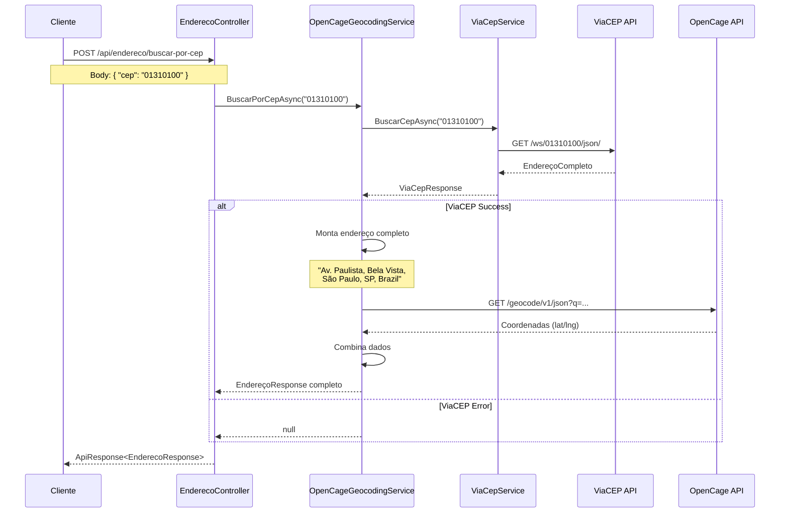

# 🗺️ Sistema de Geocodificação Híbrido - ViaCEP + OpenCage

**Data de Implementação:**  
- OpenCage: 04 de Novembro de 2025  
- ViaCEP: 17 de Novembro de 2025

**Versão:** 2.0.0  
**Status:** ✅ Implementado e Funcional

---

## 📋 Índice

1. [Visão Geral](#visão-geral)
2. [Arquitetura](#arquitetura)
3. [APIs Utilizadas](#apis-utilizadas)
4. [Fluxo de Funcionamento](#fluxo-de-funcionamento)
5. [Configuração](#configuração)
6. [Uso](#uso)
7. [Exemplos](#exemplos)
8. [Vantagens da Solução](#vantagens-da-solução)
9. [Troubleshooting](#troubleshooting)

---

## 🎯 Visão Geral

Sistema **híbrido** de geocodificação que combina **duas APIs externas** para fornecer dados completos de endereços brasileiros com máxima eficiência e economia:

### 🔄 Fluxo Duplo

```
CEP → ViaCEP → Endereço Completo
          ↓
     OpenCage → Coordenadas GPS
          ↓
     Resposta Unificada
```

### ✅ Funcionalidades

- ✅ **Busca por CEP** - Retorna endereço completo (rua, bairro, cidade, estado)
- ✅ **Geocodificação** - Converte endereço em coordenadas GPS (lat/lng)
- ✅ **Otimização de requisições** - ViaCEP primeiro (sem limite), OpenCage só quando necessário
- ✅ **Fallback inteligente** - Se OpenCage falhar, retorna dados do ViaCEP sem coordenadas
- ✅ **Logging completo** - Todas as operações registradas
- ✅ **Modularização** - Cada API em seu próprio módulo

---

## 🏗️ Arquitetura

### Diagrama de Fluxo

```
┌─────────────────────────────────────────────┐
│ Cliente (Front-end/Postman)                 │
│ POST /api/endereco/buscar-por-cep           │
│ Body: { "cep": "01310100" }                 │
└──────────────────┬──────────────────────────┘
                   │
                   ▼
┌─────────────────────────────────────────────┐
│ EnderecoController                          │
│ - Recebe request                            │
│ - Chama IGeocodingService                  │
└──────────────────┬──────────────────────────┘
                   │
                   ▼
┌─────────────────────────────────────────────┐
│ OpenCageGeocodingService                    │
│ (Implementa IGeocodingService)              │
└──────────────────┬──────────────────────────┘
                   │
       ┌───────────┴───────────┐
       │                       │
       ▼                       ▼
┌──────────────┐     ┌─────────────────┐
│ ViaCepService│     │ OpenCage API    │
└──────────────┘     └─────────────────┘
       │                       │
       │ 1. Buscar CEP        │
       │ ✅ Grátis            │
       │ ✅ Sem limite        │
       │                       │
       └─────► Endereço ──────┤
                              │
                    2. Buscar Coordenadas
                    ⚠️ 2.500 req/dia
                              │
                              ▼
                      ┌───────────────┐
                      │ Lat/Lng       │
                      └───────────────┘
                              │
                              ▼
        ┌─────────────────────────────────────┐
        │ Resposta Unificada:                 │
        │ - Rua (ViaCEP)                      │
        │ - Bairro (ViaCEP)                   │
        │ - Cidade (ViaCEP)                   │
        │ - Estado (ViaCEP)                   │
        │ - CEP (ViaCEP)                      │
        │ - Latitude (OpenCage)               │
        │ - Longitude (OpenCage)              │
        └─────────────────────────────────────┘
```

### Estrutura de Arquivos

```
Gemona.Infrastructure/
├── ExternalServices/
│   ├── ViaCep/
│   │   ├── Models/
│   │   │   └── ViaCepResponse.cs         # DTO da resposta ViaCEP
│   │   └── ViaCepService.cs              # Cliente HTTP ViaCEP
│   │
│   └── OpenCage/
│       ├── Models/
│       │   └── OpenCageResponse.cs       # DTO da resposta OpenCage
│       └── OpenCageGeocodingService.cs   # Orquestrador principal
│
└── Extensions/
    └── ServiceCollectionExtensions.cs    # Registro DI
```

---

## 🌐 APIs Utilizadas

### 1. ViaCEP (Primária)

**Responsabilidade:** Buscar endereços por CEP

- **URL Base:** `https://viacep.com.br/`
- **Endpoint:** `GET /ws/{cep}/json/`
- **Autenticação:** ❌ Não requer
- **Limite:** ✅ Sem limite (grátis)
- **Documentação:** https://viacep.com.br/

**Exemplo de Request:**
```http
GET https://viacep.com.br/ws/01310100/json/
```

**Exemplo de Response:**
```json
{
  "cep": "01310-100",
  "logradouro": "Avenida Paulista",
  "complemento": "",
  "bairro": "Bela Vista",
  "localidade": "São Paulo",
  "uf": "SP",
  "ibge": "3550308",
  "gia": "1004",
  "ddd": "11",
  "siafi": "7107"
}
```

**Vantagens:**
- ✅ API brasileira oficial
- ✅ Dados sempre atualizados (base dos Correios)
- ✅ Sem limites de requisição
- ✅ Resposta rápida
- ✅ Não requer autenticação

---

### 2. OpenCage (Secundária)

**Responsabilidade:** Obter coordenadas GPS a partir de endereço

- **URL Base:** `https://api.opencagedata.com/`
- **Endpoint:** `GET /geocode/v1/json`
- **Autenticação:** ✅ API Key obrigatória
- **Limite:** ⚠️ 2.500 requisições/dia (free tier)
- **Documentação:** https://opencagedata.com/api

**Exemplo de Request:**
```http
GET https://api.opencagedata.com/geocode/v1/json
    ?q=Avenida+Paulista,+Bela+Vista,+São+Paulo,+SP,+Brazil
    &key=SUA_API_KEY
    &language=pt-BR
    &limit=1
```

**Exemplo de Response:**
```json
{
  "results": [
    {
      "geometry": {
        "lat": -23.5614,
        "lng": -46.6561
      },
      "formatted": "Av. Paulista, Bela Vista, São Paulo - SP, Brasil"
    }
  ],
  "status": {
    "code": 200,
    "message": "OK"
  },
  "rate": {
    "limit": 2500,
    "remaining": 2499,
    "reset": 1763424000
  }
}
```

**Vantagens:**
- ✅ Geocoding global (não só Brasil)
- ✅ Alta precisão de coordenadas
- ✅ Free tier generoso (2.500 req/dia)
- ✅ Suporte a múltiplos idiomas
- ❌ Requer API key
- ❌ Limitação diária

---

## 🔄 Fluxo de Funcionamento

### Passo a Passo



### Código Simplificado

```csharp
public async Task<EnderecoResponse?> BuscarPorCepAsync(string cep)
{
    // 1. Buscar endereço no ViaCEP
    var viaCepResult = await _viaCepService.BuscarCepAsync(cep);
    if (viaCepResult == null) return null;

    // 2. Montar endereço completo para OpenCage
    var enderecoCompleto = $"{viaCepResult.Logradouro}, " +
                          $"{viaCepResult.Bairro}, " +
                          $"{viaCepResult.Localidade}, " +
                          $"{viaCepResult.Uf}, Brazil";

    // 3. Buscar coordenadas no OpenCage
    var coordenadas = await BuscarCoordenadasAsync(enderecoCompleto);

    // 4. Combinar dados (ViaCEP + OpenCage)
    return new EnderecoResponse
    {
        Rua = viaCepResult.Logradouro,
        Bairro = viaCepResult.Bairro,
        Cidade = viaCepResult.Localidade,
        Estado = viaCepResult.Uf,
        Cep = viaCepResult.Cep,
        Latitude = coordenadas?.Latitude ?? 0,
        Longitude = coordenadas?.Longitude ?? 0
    };
}
```

---

## ⚙️ Configuração

### 1. Obter API Key do OpenCage

1. Acesse https://opencagedata.com/
2. Registre-se (grátis, não requer cartão)
3. Acesse o dashboard
4. Copie sua API Key

### 2. Configurar appsettings.json

```json
{
  "OpenCage": {
    "ApiKey": "SUA_API_KEY_AQUI"
  }
}
```

### 3. Registro no DI (já configurado)

```csharp
// ServiceCollectionExtensions.cs
services.AddHttpClient<ViaCepService>();
services.AddHttpClient<IGeocodingService, OpenCageGeocodingService>();
```

---

## 💻 Uso

### Endpoint da API

```http
POST /api/endereco/buscar-por-cep
Content-Type: application/json

{
  "cep": "01310100"
}
```

### Response Success (200 OK)

```json
{
  "success": true,
  "message": "Endereço encontrado com sucesso",
  "data": {
    "rua": "Avenida Paulista",
    "numero": "",
    "complemento": "",
    "bairro": "Bela Vista",
    "cidade": "São Paulo",
    "estado": "SP",
    "cep": "01310-100",
    "latitude": -23.5614,
    "longitude": -46.6561
  },
  "errors": null
}
```

### Response Error (404 Not Found)

```json
{
  "success": false,
  "message": "CEP não encontrado",
  "data": null,
  "errors": []
}
```

---

## 📝 Exemplos

### Exemplo 1: PowerShell

```powershell
Invoke-RestMethod -Uri "https://localhost:5269/api/endereco/buscar-por-cep" `
  -Method POST `
  -ContentType "application/json" `
  -Body '{"cep":"05781270"}' `
  -SkipCertificateCheck
```

### Exemplo 2: cURL

```bash
curl -X POST https://localhost:5269/api/endereco/buscar-por-cep \
  -H "Content-Type: application/json" \
  -d '{"cep":"05781270"}' \
  -k
```

### Exemplo 3: JavaScript (Fetch API)

```javascript
const response = await fetch('https://localhost:5269/api/endereco/buscar-por-cep', {
  method: 'POST',
  headers: { 'Content-Type': 'application/json' },
  body: JSON.stringify({ cep: '05781270' })
});

const data = await response.json();
console.log(data.data.latitude, data.data.longitude);
```

---

## 🎯 Vantagens da Solução

### ✅ Economia de Requisições

**Antes (só OpenCage):**
- Cada busca de CEP = 1 requisição OpenCage
- Limite: 2.500 requisições/dia

**Depois (ViaCEP + OpenCage):**
- ViaCEP: ilimitado (dados do endereço)
- OpenCage: só para coordenadas
- Limite real: muito maior

### ✅ Maior Precisão

- **ViaCEP:** Base oficial dos Correios (endereços sempre corretos)
- **OpenCage:** Coordenadas GPS precisas

### ✅ Resiliência

```
┌────────────────┐
│ ViaCEP falha?  │
└───────┬────────┘
        │
        ├─ Sim → Retorna null
        │
        └─ Não → Continua
                      │
                      ▼
           ┌──────────────────┐
           │ OpenCage falha?  │
           └────────┬─────────┘
                    │
                    ├─ Sim → Retorna dados ViaCEP sem coordenadas
                    │
                    └─ Não → Retorna dados completos
```

### ✅ Logs Detalhados

```
[INFO] Buscando CEP 01310100
[INFO] CEP 01310100 encontrado no ViaCEP: São Paulo/SP
[INFO] Buscando coordenadas para: Avenida Paulista, Bela Vista, São Paulo, SP, Brazil
[INFO] Coordenadas obtidas com sucesso
```

---

## ⚠️ Troubleshooting

### Problema: "CEP não encontrado" (ViaCEP)

**Causas possíveis:**
- CEP inválido (não existe)
- CEP com formatação incorreta
- ViaCEP temporariamente indisponível

**Solução:**
```csharp
// CEPs válidos possuem 8 dígitos numéricos
if (cep.Length != 8 || !cep.All(char.IsDigit))
{
    return BadRequest("CEP inválido");
}
```

### Problema: "Unknown API key" (OpenCage)

**Causas:**
- API key incorreta
- API key expirada
- Limite de requisições excedido

**Solução:**
1. Verifique `appsettings.json`
2. Gere nova API key em https://opencagedata.com/
3. Verifique limite no dashboard

### Problema: Coordenadas (0, 0)

**Causa:** OpenCage falhou, mas ViaCEP retornou dados

**Solução:** Isso é esperado! O sistema tem fallback:
- Se OpenCage falhar, retorna dados do ViaCEP sem coordenadas
- Coordenadas zeradas indicam que não foi possível geocodificar

---

## 📊 Comparação Final

| Feature | Só OpenCage | ViaCEP + OpenCage |
|---------|-------------|-------------------|
| Limite diário | 2.500 | ∞ (ViaCEP) + 2.500 (OpenCage) |
| Precisão endereço | Média | Alta (Correios) |
| Precisão coordenadas | Alta | Alta |
| Custo | Free tier | Free (ambos) |
| Fallback | ❌ | ✅ |
| Logs | Básico | Detalhado |
| Modularidade | Baixa | Alta |

---

**✅ Sistema otimizado, econômico e resiliente!**
